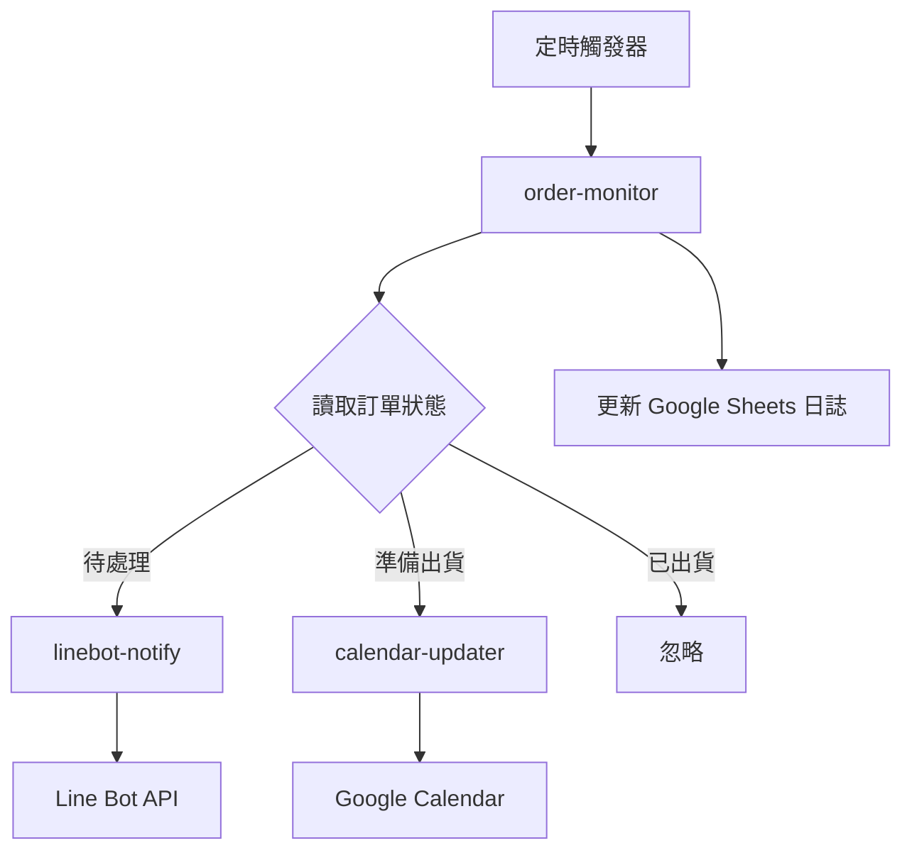

# 訂單日曆自動化系統架構

## 專案概述
自動將訂單資訊更新到 Google 日曆的系統，支援訂單狀態監控、自動更新、Line Bot 通知等功能。

## 系統架構圖

```
┌─────────────────┐    ┌──────────────────┐    ┌─────────────────┐
│   前端 (React)   │    │  Google Sheets   │    │  Google Calendar │
│                 │    │    (資料庫)       │    │      (日曆)      │
└─────────────────┘    └──────────────────┘    └─────────────────┘
         │                        │                        │
         │                        │                        │
         └────────────────────────┼────────────────────────┘
                                  │
                    ┌─────────────▼──────────────┐
                    │   Google Cloud Functions    │
                    │   ┌─────────────────────┐   │
                    │   │  訂單監控函數       │   │
                    │   │  (order-monitor)    │   │
                    │   └─────────────────────┘   │
                    │   ┌─────────────────────┐   │
                    │   │  日曆更新函數       │   │
                    │   │ (calendar-updater)  │   │
                    │   └─────────────────────┘   │
                    │   ┌─────────────────────┐   │
                    │   │  Line Bot 通知函數  │   │
                    │   │  (linebot-notify)   │   │
                    │   └─────────────────────┘   │
                    └────────────────────────────┘
                                  │
                    ┌─────────────▼──────────────┐
                    │        Line Bot API        │
                    └────────────────────────────┘
```

## 檔案和資料夾結構

```
order-calendar-automation/
├── README.md
├── architecture.md                    # 本架構文件
├── .gitignore
├── package.json
├── 
├── frontend/                          # 前端應用
│   ├── package.json
│   ├── tsconfig.json
│   ├── public/
│   │   ├── index.html
│   │   └── favicon.ico
│   ├── src/
│   │   ├── components/               # React 組件
│   │   │   ├── Dashboard/
│   │   │   │   ├── OrderList.tsx
│   │   │   │   ├── CalendarView.tsx
│   │   │   │   └── StatusPanel.tsx
│   │   │   ├── Settings/
│   │   │   │   ├── ConfigPanel.tsx
│   │   │   │   └── APISettings.tsx
│   │   │   └── Common/
│   │   │       ├── Header.tsx
│   │   │       ├── Navigation.tsx
│   │   │       └── Loading.tsx
│   │   ├── services/                 # API 服務層
│   │   │   ├── googleSheetsAPI.ts
│   │   │   ├── googleCalendarAPI.ts
│   │   │   ├── cloudFunctionsAPI.ts
│   │   │   └── authService.ts
│   │   ├── types/                    # TypeScript 類型定義
│   │   │   ├── Order.ts
│   │   │   ├── Calendar.ts
│   │   │   ├── User.ts
│   │   │   └── API.ts
│   │   ├── utils/                    # 工具函數
│   │   │   ├── dateUtils.ts
│   │   │   ├── orderUtils.ts
│   │   │   └── constants.ts
│   │   ├── store/                    # 狀態管理
│   │   │   ├── index.ts
│   │   │   ├── orderStore.ts
│   │   │   ├── calendarStore.ts
│   │   │   └── systemStore.ts
│   │   ├── App.tsx
│   │   ├── index.tsx
│   │   └── styles/
│   │       ├── globals.css
│   │       └── components.css
│   └── build/                        # 建置輸出目錄
│
├── backend/                          # 後端雲端函數
│   ├── package.json
│   ├── tsconfig.json
│   ├── src/
│   │   ├── functions/                # Google Cloud Functions
│   │   │   ├── order-monitor/        # 訂單監控函數
│   │   │   │   ├── index.ts
│   │   │   │   ├── orderService.ts
│   │   │   │   ├── sheetsService.ts
│   │   │   │   └── package.json
│   │   │   ├── calendar-updater/     # 日曆更新函數
│   │   │   │   ├── index.ts
│   │   │   │   ├── calendarService.ts
│   │   │   │   ├── orderMerger.ts
│   │   │   │   └── package.json
│   │   │   └── linebot-notify/       # Line Bot 通知函數
│   │   │       ├── index.ts
│   │   │       ├── lineBotService.ts
│   │   │       ├── messageBuilder.ts
│   │   │       └── package.json
│   │   ├── shared/                   # 共用模組
│   │   │   ├── types/
│   │   │   │   ├── Order.ts
│   │   │   │   ├── Calendar.ts
│   │   │   │   └── System.ts
│   │   │   ├── utils/
│   │   │   │   ├── dateUtils.ts
│   │   │   │   ├── logUtils.ts
│   │   │   │   └── authUtils.ts
│   │   │   ├── services/
│   │   │   │   ├── GoogleSheetsClient.ts
│   │   │   │   ├── GoogleCalendarClient.ts
│   │   │   │   └── LineBotClient.ts
│   │   │   └── constants/
│   │   │       ├── orderStatus.ts
│   │   │       ├── calendarColors.ts
│   │   │       └── systemConfig.ts
│   │   └── tests/                    # 測試檔案
│   │       ├── unit/
│   │       └── integration/
│   └── dist/                         # 編譯輸出目錄
│
├── config/                           # 配置檔案
│   ├── development.json
│   ├── production.json
│   ├── google-credentials.json       # Google API 憑證
│   └── deploy.yaml                   # 部署配置
│
├── scripts/                          # 自動化腳本
│   ├── deploy.sh                     # 部署腳本
│   ├── setup.sh                      # 初始化腳本
│   └── backup.sh                     # 資料備份腳本
│
├── docs/                             # 文件
│   ├── api-documentation.md
│   ├── deployment-guide.md
│   ├── user-manual.md
│   └── troubleshooting.md
│
└── monitoring/                       # 監控配置
    ├── alerts.yaml
    ├── dashboards.json
    └── logs-config.yaml
```

## 核心組件功能說明

### 1. 前端 (React + TypeScript)

#### 主要功能
- **訂單列表顯示**: 即時顯示所有訂單狀態
- **日曆視圖**: 整合 Google Calendar 的預約檢視
- **系統控制面板**: 監控系統運行狀態
- **設定管理**: API 金鑰、系統參數配置

#### 狀態管理 (Zustand)
```typescript
// store/orderStore.ts
interface OrderStore {
  orders: Order[]
  loading: boolean
  fetchOrders: () => Promise<void>
  updateOrderStatus: (orderId: string, status: OrderStatus) => Promise<void>
}

// store/calendarStore.ts
interface CalendarStore {
  events: CalendarEvent[]
  syncStatus: SyncStatus
  mergedEvents: MergedEvent[]
  syncCalendar: () => Promise<void>
}

// store/systemStore.ts
interface SystemStore {
  logs: SystemLog[]
  systemStatus: SystemStatus
  config: SystemConfig
  updateConfig: (config: Partial<SystemConfig>) => Promise<void>
}
```

### 2. 後端雲端函數

#### A. 訂單監控函數 (order-monitor)
```typescript
// functions/order-monitor/index.ts
export const orderMonitor = functions.pubsub
  .schedule('every 30 minutes')
  .onRun(async (context) => {
    // 1. 讀取 Google Sheets 訂單資料
    // 2. 比對訂單狀態變化
    // 3. 觸發相應的處理流程
    // 4. 記錄系統日誌
  });
```

**功能**:
- 定時執行 (每30分鐘)
- 讀取 Google Sheets 訂單資料
- 檢測訂單狀態變化
- 觸發後續處理流程

#### B. 日曆更新函數 (calendar-updater)
```typescript
// functions/calendar-updater/index.ts
export const calendarUpdater = functions.https.onCall(async (data, context) => {
  // 1. 處理準備出貨的訂單
  // 2. 檢查是否需要合併訂單
  // 3. 更新 Google Calendar
  // 4. 記錄更改次數
});
```

**功能**:
- 處理「準備出貨」狀態的訂單
- 實現訂單合併邏輯 (同一天同一會員)
- 更新到 Google Calendar
- 管理日曆事件顏色
- 記錄更改次數

#### C. Line Bot 通知函數 (linebot-notify)
```typescript
// functions/linebot-notify/index.ts
export const linebotNotify = functions.https.onCall(async (data, context) => {
  // 1. 處理待處理狀態的訂單
  // 2. 組裝通知訊息
  // 3. 發送 Line 通知
  // 4. 記錄通知日誌
});
```

**功能**:
- 處理「待處理」狀態的訂單
- 發送 Line Bot 通知
- 支援豐富的訊息格式
- 錯誤重試機制

### 3. 資料存儲 (Google Sheets)

#### 工作表結構

**訂單資料表 (Orders)**
| 欄位 | 說明 | 範例 |
|------|------|------|
| 訂單ID | 唯一識別碼 | ORD-001 |
| 會員資訊 | 客戶姓名/聯絡方式 | 張三 / 0912345678 |
| 商品 | 商品名稱和數量 | 蛋糕 x2, 咖啡 x1 |
| 領取時間 | 預定領取時間 | 2024-01-15 14:00 |
| 訂單狀態 | 待處理/準備出貨/已出貨 | 準備出貨 |
| 更改次數 | 訂單修改次數 | 2 |
| 最後更新時間 | 系統更新時間 | 2024-01-14 16:30 |

**系統日誌表 (SystemLogs)**
| 欄位 | 說明 |
|------|------|
| 時間戳記 | 日誌記錄時間 |
| 功能模組 | 觸發的功能 |
| 動作類型 | 建立/更新/刪除/通知 |
| 訂單ID | 相關訂單 |
| 執行結果 | 成功/失敗 |
| 錯誤訊息 | 失敗原因 |

### 4. 服務連接與整合

#### API 整合流程


#### 認證與授權
- **Google APIs**: 使用 Service Account 憑證
- **Line Bot**: 使用 Channel Access Token
- **前端認證**: Google OAuth 2.0

## 資料流程

### 1. 訂單狀態監控流程
```
定時器觸發 → 讀取 Google Sheets → 比對狀態變化 → 執行相應動作 → 記錄日誌
```

### 2. 日曆更新流程
```
準備出貨訂單 → 檢查合併條件 → 建立/更新日曆事件 → 設定顏色 → 記錄更改次數
```

### 3. 合併邏輯
- **條件**: 同一天 + 同一會員
- **合併方式**: 
  - 標題: `會員姓名 - 領取 (共X筆訂單)`
  - 內容: 列出所有商品清單
  - 時間: 使用最早的領取時間

### 4. 顏色管理
- **預設顏色**: 藍色 (新訂單)
- **完成領取**: 綠色 (手動更改)
- **異常狀況**: 紅色 (系統標記)

## 錯誤處理與監控

### 1. 錯誤處理策略
- **API 呼叫失敗**: 指數退避重試
- **資料格式錯誤**: 記錄詳細錯誤並跳過
- **網路問題**: 自動重試機制
- **權限問題**: 即時告警通知

### 2. 監控與告警
- **系統健康檢查**: 每小時自動檢測
- **API 配額監控**: 防止超出使用限制
- **錯誤率告警**: 超過閾值時發送通知
- **效能監控**: 追蹤函數執行時間

### 3. 日誌管理
- **集中式日誌**: 所有操作記錄到 Google Sheets
- **日誌等級**: INFO, WARN, ERROR
- **日誌輪轉**: 自動清理過期日誌

## 部署與維護

### 1. 部署流程
```bash
# 1. 初始化專案
./scripts/setup.sh

# 2. 配置環境變數
cp config/development.json config/production.json

# 3. 部署雲端函數
./scripts/deploy.sh production

# 4. 設定定時觸發器
gcloud scheduler jobs create pubsub order-monitor-job \
  --schedule="*/30 * * * *" \
  --topic=order-monitor \
  --message-body="{}"
```

### 2. 環境配置
```json
{
  "google": {
    "projectId": "your-project-id",
    "sheetsId": "your-sheets-id",
    "calendarId": "your-calendar-id"
  },
  "linebot": {
    "channelAccessToken": "your-line-token",
    "channelSecret": "your-line-secret"
  },
  "system": {
    "monitorInterval": 30,
    "retryAttempts": 3,
    "logRetentionDays": 30
  }
}
```

### 3. 監控面板
- **訂單處理統計**: 成功/失敗數量
- **系統效能指標**: 執行時間、記憶體使用
- **API 使用狀況**: 配額使用率
- **錯誤追蹤**: 錯誤類型分析

## 安全性考量

### 1. 資料安全
- **API 金鑰加密**: 使用 Google Secret Manager
- **最小權限原則**: 限制 API 存取範圍
- **資料備份**: 定期備份重要資料

### 2. 存取控制
- **前端認證**: Google OAuth 限制使用者
- **API 防護**: 實作速率限制
- **日誌審計**: 記錄所有敏感操作

## 擴充性設計

### 1. 水平擴展
- **無伺服器架構**: 自動調整資源
- **API 限流**: 避免超出服務限制
- **快取策略**: 減少重複 API 呼叫

### 2. 功能擴展
- **多通路通知**: 支援 Email、SMS 等
- **多日曆整合**: 支援多個 Google Calendar
- **進階分析**: 訂單趨勢分析功能

---

此架構提供了完整的訂單日曆自動化解決方案，具備良好的可維護性、擴展性和穩定性。透過模組化設計，各組件可以獨立開發、測試和部署，確保系統的高可用性。